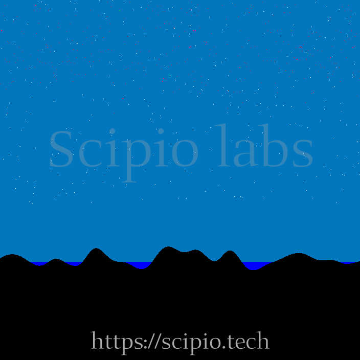

# meteor-challenge

Meteor Challenge ScipioLab

The challenge is to analyze the image:

The objective is to count certain items on the image:

- Meteors: red dots (255,0,0)
- Stars: white dots (0,0,0)
- Quantity of meteors that hit the water (0,0,255)
